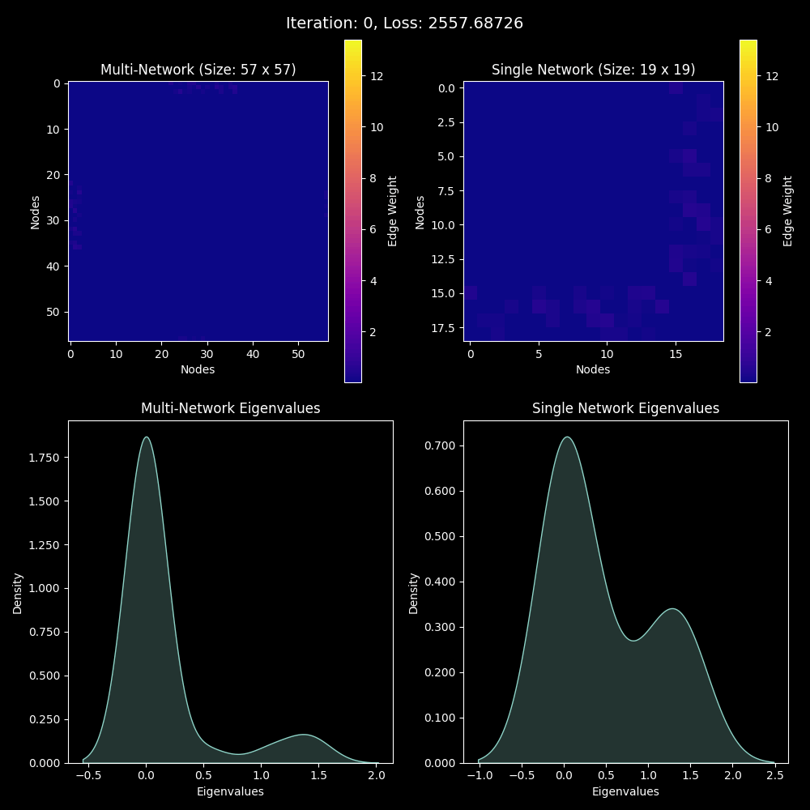

# Multiplex Network Visualization

## `Adjacency Matrix Evolution Over Training`

The follow gif was generated by running `training_adjacency/demo.py`. The script trains a custom PyTorch model to approximate a 3D Rosenbrock function. The gif shows the evolution of the adjacency matrix over the course of training.

## `3D Interactive Visualization`

The following gif demonstrates our latest experiments in interactive 3D visualization using the Dash Python library. To run locally, execute the python script, `3d_dash_visualization.py`.

