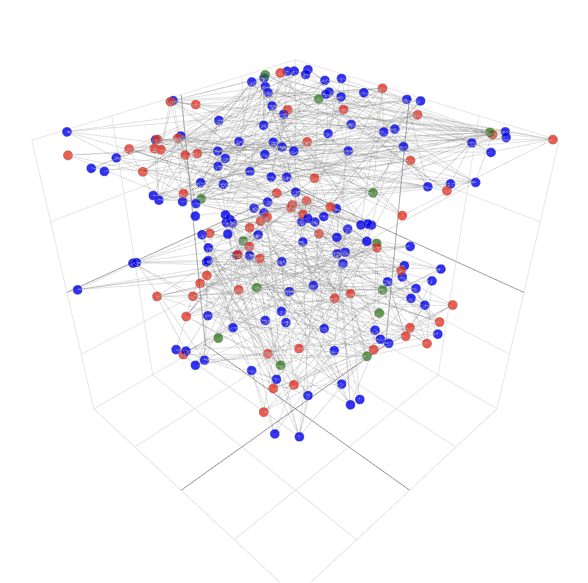

# Multiplex Network Visualization

## `Adjacency Matrix Evolution Over Training`

The follow gif was generated by running `training_adjacency/demo.py`. The script trains a custom PyTorch model to approximate a 3D Rosenbrock function. The gif shows the evolution of the adjacency matrix over a subset of training iterations.

There are known issues with the supra-adjacency visualization.

## `3D Visualization of Disease Spread`

Start the dash app by running `simulations/disease_spread.py`.

